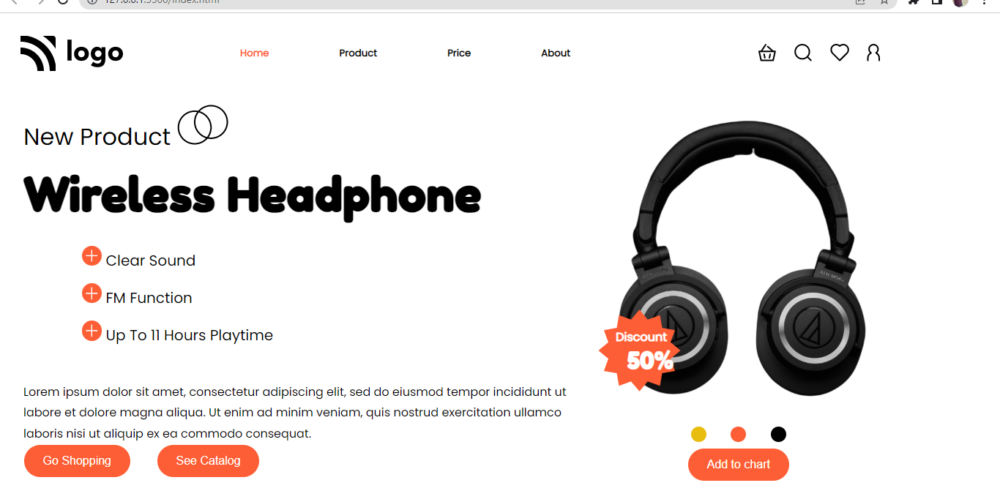

 ##  Name- vikas kumar taliyan
  
  
  

 # Product Homepage
 Product Homepage is a Homepage which describes about the wireless Headphones and their functionality.

 # Project Description.
### Working.
This is a Wireless Headphone Homepage which allow user to see the product and their functionality and and there are many options available like-
* Go shopping 
* See catalog
* Add to cart

# Screenshot.

### Technology
* HTML
* css
##### HTML
In HTML i use paragraphs, heading and ids and classes to target HTML elements effectively.
##### CSS
In CSS i used flexbox in creating navbar positions to set set an element in DOM.

# Credits.
A big thanks to the Hitesh choudhary and Inueron which gave a Oppurtunity to learn and grow.